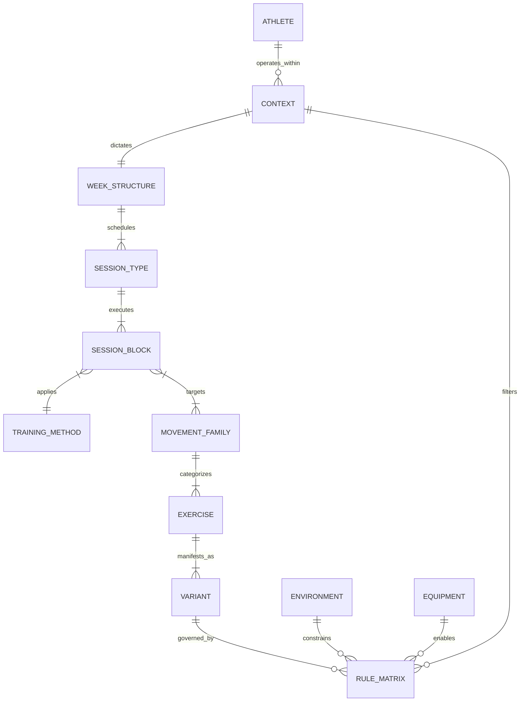

# FORGE V2.5 Coaching Ontology Foundation

## 1. Domain Model Hierarchy

### Athlete
1. **Purpose**: Root entity. Represents the physical human.
2. **Ownership**: System-level identity management.
3. **Examples**: John Doe (ID: 1234).
4. **Relationships**: 1:N with Context.
5. **Extensibility**: Bio-markers, historic injury logs, biometric hardware linkages stored as JSONB.

### Context
1. **Purpose**: The situational wrapper dictating program constraints at a specific moment.
2. **Ownership**: Periodization/Diagnostic layers.
3. **Examples**: Off-Season, Advanced Training Age, Patellar Tendinopathy constraint, 3-week block.
4. **Relationships**: N:1 with Athlete, 1:1 with Week Structure.
5. **Extensibility**: Phase goals, acute fatigue state, travel schedule appended as key-value pairs without altering schema.

### Training Week Structure
1. **Purpose**: Microcycle blueprint defining distribution of physiological stress across days.
2. **Ownership**: Program Generator.
3. **Examples**: 3-Day Non-Consecutive, 4-Day Upper/Lower Split.
4. **Relationships**: 1:N with Session Types.
5. **Extensibility**: Support for non-7-day microcycles (e.g., 10-day elite rotations) via generic `day_offset` arrays.

### Session Type
1. **Purpose**: Overarching physiological intent and environmental setting for a single workout.
2. **Ownership**: Coach / Macro-planning layer.
3. **Examples**: Gym Strength, Gym Power, Field Speed, Field Conditioning, Recovery, Hybrid.
4. **Relationships**: N:1 with Week Structure, 1:N with Session Blocks.
5. **Extensibility**: Tags like `metabolic_dominant` or `neurological_dominant` allow AI to balance weekly CNS load.

### Session Block
1. **Purpose**: Logical grouping of work within a session (e.g., A-series, B-series). Defines flow.
2. **Ownership**: Session Generator.
3. **Examples**: Prep/Warm-up, Primary Power, Primary Strength, Secondary/Accessory, Core/Trunk.
4. **Relationships**: N:1 with Session Type, 1:1 with Training Method, 1:N with Movement Families.
5. **Extensibility**: Unlimited blocks. Can be nested (e.g., Block A contains Block A1, A2) for complex supersets.

### Training Method
1. **Purpose**: The exact application of stimulus (sets, reps, rest, tempo, load profile).
2. **Ownership**: Progression Engine.
3. **Examples**: Traditional, Contrast, French Contrast, Cluster, Complex, Reactive, Isometric, Tempo, Velocity Based, Triphasic.
4. **Relationships**: 1:N with Session Blocks.
5. **Extensibility**: Abstract parameters (`intensity_metric`, `rest_schema`). Allows adding "Drop Sets" or "Myo-Reps" by injecting new JSON method profiles.

### Movement Family
1. **Purpose**: Core biomechanical categorization of human movement. Agnostic of equipment.
2. **Ownership**: Exercise Ontology.
3. **Examples**: Double Leg Knee Dominant, Double Leg Hip Dominant, Single Leg Knee Dominant, Single Leg Hip Dominant, Horizontal Push, Horizontal Pull, Vertical Push, Vertical Pull, Carry, Core, Plyometric, Ballistic, Sprint, Change Of Direction.
4. **Relationships**: N:1 with Session Blocks, 1:N with Exercises.
5. **Extensibility**: New planes of motion (e.g., "Transverse Rotation") added as pure lookup rows.

### Exercise
1. **Purpose**: The base movement pattern manifestation.
2. **Ownership**: Exercise Ontology.
3. **Examples**: Squat, Deadlift, Bench Press, Box Jump.
4. **Relationships**: N:1 with Movement Family, 1:N with Variants.
5. **Extensibility**: Represents the conceptual movement. Never directly prescribed.

### Variant
1. **Purpose**: The exact, executable movement including implement, stance, and modifier.
2. **Ownership**: Exercise Ontology.
3. **Examples**: Barbell Back Squat, Dumbbell Goblet Squat, Band-Resisted Trap Bar Deadlift.
4. **Relationships**: N:1 with Exercise, N:N with Environment/Equipment.
5. **Extensibility**: Unlimited combinations. Modifiers (Banded, Deficit, Paused) exist as metadata tags.

---

## 2. Entity Diagram



---

## 3. Database Schema Proposal

```sql
-- Core Ontology lookup tables
CREATE TABLE movement_families (
    id SERIAL PRIMARY KEY,
    name VARCHAR(100) UNIQUE NOT NULL,
    biomechanical_tags JSONB -- e.g., {"plane": "sagittal", "joint": "multi"}
);

CREATE TABLE training_methods (
    id SERIAL PRIMARY KEY,
    name VARCHAR(100) UNIQUE NOT NULL,
    execution_logic JSONB NOT NULL -- e.g., {"requires_pairing": true, "max_exercises": 4}
);

CREATE TABLE session_types (
    id SERIAL PRIMARY KEY,
    name VARCHAR(100) UNIQUE NOT NULL,
    environment_target VARCHAR(50) -- Gym, Field, Track
);

-- Exercise Hierarchy
CREATE TABLE exercises (
    id SERIAL PRIMARY KEY,
    family_id INT REFERENCES movement_families(id),
    name VARCHAR(100) NOT NULL
);

CREATE TABLE variants (
    id SERIAL PRIMARY KEY,
    exercise_id INT REFERENCES exercises(id),
    name VARCHAR(150) NOT NULL,
    technical_complexity INT CHECK (technical_complexity BETWEEN 1 AND 5),
    force_vector VARCHAR(50),
    required_equipment JSONB, -- Array of required equipment IDs
    metadata JSONB -- Modifiers, unilateral flags, etc.
);

-- Program Structure
CREATE TABLE week_structures (
    id SERIAL PRIMARY KEY,
    name VARCHAR(100),
    day_count INT,
    structure_data JSONB -- e.g., {"day_1": "Gym Strength", "day_2": "Recovery"}
);

CREATE TABLE session_blocks (
    id SERIAL PRIMARY KEY,
    session_type_id INT REFERENCES session_types(id),
    method_id INT REFERENCES training_methods(id),
    block_order INT,
    block_label VARCHAR(10) -- 'A', 'B', 'C'
);

-- Rules Engine Table (Polymorphic)
CREATE TABLE ontology_rules (
    id SERIAL PRIMARY KEY,
    subject_type VARCHAR(50), -- e.g., 'AthleteConstraint', 'Environment'
    subject_id VARCHAR(50),   -- e.g., 'PatellarTendinopathy', 'Travel'
    rule_type VARCHAR(20),    -- 'Forbidden', 'Allowed', 'Preferred'
    object_type VARCHAR(50),  -- e.g., 'MovementFamily', 'Variant', 'Equipment'
    object_id VARCHAR(50),    -- e.g., 'DoubleLegKneeDominant', 'Barbell'
    priority INT DEFAULT 0
);

-- Indexes for rapid filtering
CREATE INDEX idx_variants_metadata ON variants USING GIN (metadata);
CREATE INDEX idx_rules_polymorphic ON ontology_rules (subject_type, subject_id, rule_type);
```

---

## 4. Rule Engine Proposal

The engine operates on a subtractive-then-additive matrix using the `ontology_rules` table.

### Concept: Tri-State Matrix
1. **Forbidden**: Hard constraint. Drops variants/methods from the pool entirely. (Multiplies selection probability by 0).
2. **Allowed**: Neutral state. Exists in the pool. (Multiplies selection probability by 1).
3. **Preferred**: Soft constraint. Elevates ranking. (Multiplies selection probability by 2+).

### Relationship Evaluation Flow:
1. **Environment -> Equipment**: If Environment = `Travel` -> Rule `Forbidden` -> Equipment = `Barbell`.
2. **Equipment -> Variant**: Variant `Barbell Back Squat` requires `Barbell`. Barbell is Forbidden. Variant dropped.
3. **Athlete Constraint -> Movement Family**: Context = `In-Season + High Fatigue` -> Rule `Forbidden` -> Method = `Triphasic`.
4. **Athlete Constraint -> Variant**: Context = `Shoulder Impingement` -> Rule `Forbidden` -> Movement Family = `Vertical Push`.

*Future Proofing*: Because rules map `subject_type` to `object_type` dynamically, adding a new constraint (e.g., "Facility Height Limit") mapping to "Forbidden" -> "Movement Family: Vertical Throw" requires zero schema changes.

---

## 5. Example Data Model: Week Structures

### 2-Day Program
```json
{
  "name": "2-Day In-Season Consolidation",
  "schedule": [
    {"day": 1, "session_type": "Gym Power", "primary_focus": ["Full Body"]},
    {"day": 4, "session_type": "Gym Strength", "primary_focus": ["Full Body"]}
  ]
}
```

### 3-Day Program
```json
{
  "name": "3-Day Off-Season Accumulation",
  "schedule": [
    {"day": 1, "session_type": "Gym Strength", "primary_focus": ["Lower Body"]},
    {"day": 3, "session_type": "Gym Strength", "primary_focus": ["Upper Body"]},
    {"day": 5, "session_type": "Gym Power", "primary_focus": ["Full Body"]}
  ]
}
```

### 4-Day Program
```json
{
  "name": "4-Day Intensive Split",
  "schedule": [
    {"day": 1, "session_type": "Gym Strength", "primary_focus": ["Lower Heavy"]},
    {"day": 2, "session_type": "Gym Strength", "primary_focus": ["Upper Heavy"]},
    {"day": 4, "session_type": "Gym Power", "primary_focus": ["Lower Dynamic"]},
    {"day": 5, "session_type": "Gym Power", "primary_focus": ["Upper Dynamic"]}
  ]
}
```

---

## 6. Example Data Model: Session Blocks & Methods

### Traditional Session (Gym Strength)
Linear execution of blocks.
```json
{
  "block_A": {
    "method": "Traditional",
    "movements": [{"family": "Double Leg Knee Dominant", "reps": "4x5"}],
    "execution": "Straight sets, 2 min rest."
  },
  "block_B": {
    "method": "Traditional",
    "movements": [{"family": "Horizontal Pull", "reps": "3x8"}],
    "execution": "Straight sets, 90 sec rest."
  }
}
```

### Contrast Session (Gym Power)
Pairing high-force with high-velocity.
```json
{
  "block_A": {
    "method": "Contrast",
    "movements": [
      {"order": "A1", "family": "Double Leg Hip Dominant", "variant_constraint": "Heavy/Slow", "reps": "4x3"},
      {"order": "A2", "family": "Ballistic", "variant_constraint": "Light/Fast", "reps": "4x5"}
    ],
    "execution": "Perform A1, rest 15s. Perform A2, rest 2m."
  }
}
```

### French Contrast Session (Advanced Power)
Four-exercise potentiation cluster.
```json
{
  "block_A": {
    "method": "French Contrast",
    "movements": [
      {"order": "A1", "family": "Double Leg Knee Dominant", "variant_constraint": "Heavy (85%+)", "reps": "3x3"},
      {"order": "A2", "family": "Plyometric", "variant_constraint": "Bodyweight", "reps": "3x4"},
      {"order": "A3", "family": "Ballistic", "variant_constraint": "Light Load (30%)", "reps": "3x5"},
      {"order": "A4", "family": "Sprint", "variant_constraint": "Assisted/Overspeed", "reps": "3x10m"}
    ],
    "execution": "Perform A1->A4 sequentially. 15s between exercises. 3m between series."
  }
}
```