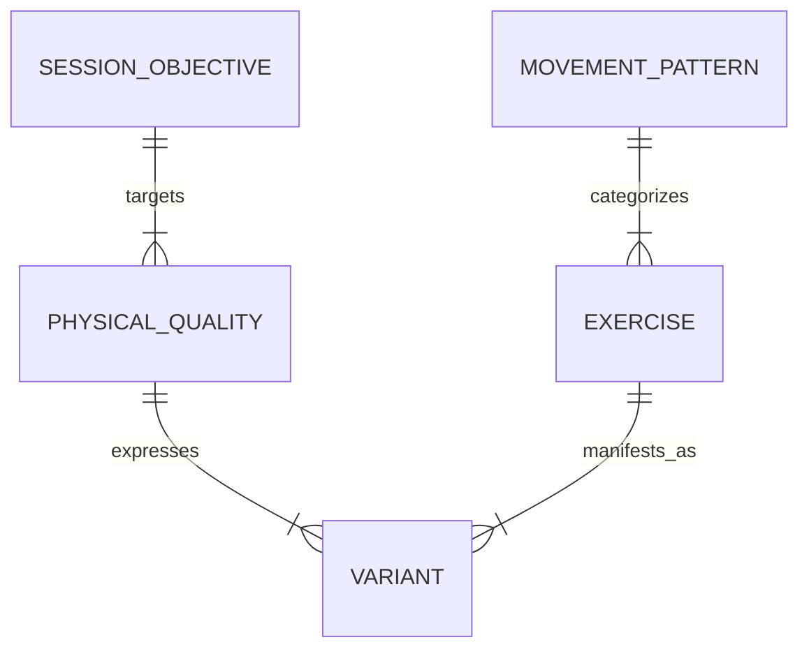
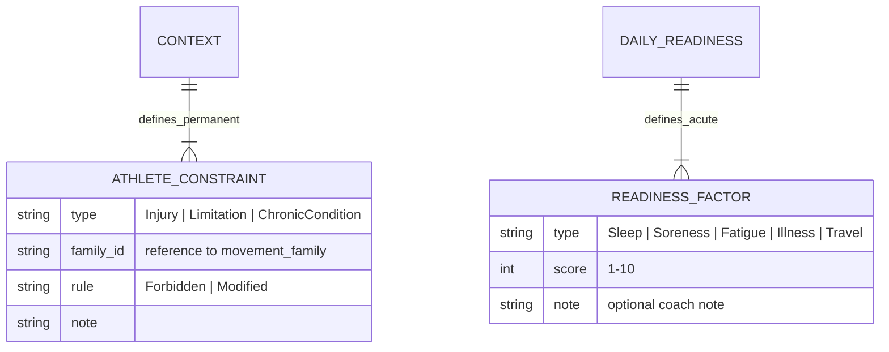

# FORGE V2.5 Coaching Ontology — Revision 2

## Gap Closure Summary

| V1 Gap | V2 Fix |
|---|---|
| No Session Objective layer | Inserted between Session Type and Block |
| Movement Pattern & Physical Quality conflated | Fully separated into two independent axes |
| Conditioning treated as an afterthought | Full conditioning hierarchy with its own rules |
| Pairing as tags on exercises | Pairing as first-class entities with typed relationships |
| Environment as a metadata field | Environment as a planning entity with constraints |
| Readiness collapsed into Context | Split into Long-Term Context + Daily Readiness State |
| Extensibility asserted but untested | Explicit mapping for 5 distinct athlete types |

---

## 1. Revised Ontology Diagram

```
Athlete
  └── Long-Term Context (Phase, Injury History, Training Age, Position)
       └── Daily Readiness State (Sleep, Soreness, Fatigue, Illness)
            └── Training Week Structure 
                 └── Session Type (Gym Strength, Field Speed, etc.)
                      └── Session Objective (Max Strength, Power, RSA, etc.)   ← NEW
                           ├── Session Block A (warm-up / prep)
                           ├── Session Block B (primary work)
                           │    ├── Training Method (Traditional, Contrast, Cluster, etc.)
                           │    ├── Pairing Entity (if applicable)              ← NEW
                           │    │    ├── Contrast Pair
                           │    │    ├── Complex Pair
                           │    │    ├── French Contrast Cluster
                           │    │    └── Potentiation Sequence
                           │    └── Movement Family × Physical Quality          ← SEPARATED
                           │         ├── Movement Pattern (e.g., DL Knee Dominant)
                           │         └── Physical Quality (e.g., Power)
                           ├── Session Block C (secondary / accessory)
                           └── Conditioning Block                              ← NEW
                                ├── Energy System Target (Aerobic, Anaerobic)
                                ├── Method (Extensive Tempo, HIIT, MAS, etc.)
                                └── Modality (Run, Bike, Row, Sled, Sport)
```

---

## 2. Session Objectives

### Purpose
Bridge between *what the session is* (Session Type) and *how work is structured* (Blocks).

| Objective | Typical Block Position | Example Intent |
|---|---|---|
| Max Strength | B1 (primary) | High load, low reps, long rest |
| Relative Strength | B1 | Bodyweight or load-to-weight ratio |
| Hypertrophy | B2 or C | Moderate load, high volume, short rest |
| Power | B1 | Moderate load, explosive intent, full recovery |
| Acceleration | Field session | 0-20m fly, full recovery |
| Max Velocity | Field session | 20m+ fly, full recovery |
| Change of Direction | Field or gym | Drills with directional change |
| Aerobic Capacity | Conditioning | Steady state, threshold work |
| Repeat Sprint Ability | Conditioning | Short sprints, incomplete recovery |
| Rotational Power | B1 or B2 | Rotational ballistics, medicine ball |
| Recovery | Whole session | Low intensity, mobility, blood flow |

### How Objectives Drive Exercise Selection
Each Objective has a **preferred loading range**, **rest profile**, and **movement family compatibility matrix**:

- `Power` → Ballistic, Plyometric, Weightlifting derivatives. 60-80% 1RM or bodyweight. 2-3 min rest.
- `Max Strength` → DL Knee Dominant, DL Hip Dominant, Horizontal Push. 80-95% 1RM. 3-5 min rest.
- `Hypertrophy` → Any family. 65-80% 1RM. 45-60s rest. Mechanical tension focus.
- `COD` → Single leg, Sprint, Change Of Direction families. Low external load. Full recovery.
- `RSA` → Sprint family. 15-40m efforts. 1:3 work:rest.

The Objective **filters** available Movement Families before any variant selection occurs.

---

## 3. Physical Quality Layer

### Separation of Concerns



A **Movement Pattern** is the plane and joint action.
A **Physical Quality** is the expression goal.

The same Exercise can satisfy multiple Qualities:

| Exercise | Movement Pattern | Satisfies Qualities | How |
|---|---|---|---|
| Trap Bar Deadlift | DL Hip Dominant | Strength (high load), Power (explosive variant), Capacity (high rep) | Load changes quality |
| Box Jump | Plyometric | Power (low box, explosive), Reactive (depth jump variant), Hypertrophy (high rep, low box) | Height + intent changes quality |
| Medicine Ball Rotational Chest Pass | Ballistic | Power (heavy ball, max effort), Reactive (catch & return), Capacity (timed sets) | Tempo + load changes quality |
| Nordic Hamstring Curl | SL Knee Flexion | Strength (eccentric overload), Reactive (release & catch), Rehab (isometric hold) | Execution style changes quality |
| Sprint | Sprint | Acceleration (short), Max Velocity (longer), RSA (repeat), COD (with direction change) | Distance + rest changes quality |

### Database Impact
Add `physical_quality` as a column on `variants` and a join table `variant_quality_map`:

```sql
CREATE TABLE variant_quality_map (
    variant_id INT REFERENCES variants(id),
    quality_id INT REFERENCES physical_qualities(id),
    PRIMARY KEY (variant_id, quality_id)
);
```

This allows the same `Barbell Back Squat` to map to both `Strength` and `Hypertrophy` depending on prescription intent.

---

## 4. Conditioning Ontology

### Full Hierarchy

```
Conditioning (Top-level Session Block)
├── Energy System
│   ├── Aerobic
│   │   ├── Recovery (HR < 130, low effort)
│   │   ├── Extensive Tempo (30-60min, 130-150 HR)
│   │   ├── Intensive Tempo (15-30min, 150-170 HR)
│   │   └── Threshold (V02max pace, 10-20min)
│   └── Anaerobic
│       ├── HIIT (30s all out / 4min rest, cycling or sprint)
│       ├── MAS (Maximal Aerobic Speed intervals, 2:1 rest)
│       ├── Repeat Sprint Ability (5-15s sprint, <1:4 rest)
│       └── Alactic Sprint (<10s, full recovery, power focus)
├── Modality
│   ├── Run (Track, Turf, Grass)
│   ├── Bike (Stationary, Road)
│   ├── Row
│   ├── Sled (Push, Pull, Drag)
│   └── Sport-Specific Drill
└── Integration Rules
    ├── Conditioning blocks always come AFTER strength/power blocks
    ├── Conditioning duration and intensity should not compromise next day's session
    └── Not allowed on "Recovery" session types
```

### Conditioning vs Strength Selection
- Conditioning does NOT use `movement_families` or `variants`. It uses energy system, duration, intensity metric.
- Conditioning blocks have their own progression rules (time-based, distance-based, intensity ramp).
- Conditioning is environment-aware (a field athlete with no gym can still train).

---

## 5. Pairing Relationships

### First-Class Entities

```sql
CREATE TABLE pairing_types (
    id SERIAL PRIMARY KEY,
    name VARCHAR(100) UNIQUE NOT NULL, -- 'Contrast', 'Complex', 'FrenchContrast', 'PotentiationSequence'
    max_exercises INT NOT NULL,
    requires_loading_contrast BOOLEAN DEFAULT TRUE,
    rest_between_exercises_seconds INT,
    rest_between_rounds_int INT
);

CREATE TABLE pairing_instances (
    id SERIAL PRIMARY KEY,
    session_block_id INT REFERENCES session_blocks(id),
    pairing_type_id INT REFERENCES pairing_types(id),
    round_count INT DEFAULT 4,
    series_rest_seconds INT
);

CREATE TABLE pairing_slots (
    id SERIAL PRIMARY KEY,
    pairing_instance_id INT REFERENCES pairing_instances(id),
    slot_order INT NOT NULL,
    movement_family_id INT REFERENCES movement_families(id),
    physical_quality_id INT REFERENCES physical_qualities(id),
    load_intent VARCHAR(50), -- 'heavy/slow', 'light/fast', 'bodyweight', 'assisted'
    reps INT,
    rest_seconds INT
);
```

### Example Objects

**Contrast Pair** (A1 + A2):
- A1: DL Hip Dominant / Strength / Heavy-Slow / 3 reps
- A2: Ballistic / Power / Light-Fast / 5 reps
- Rest between: 20s
- Rest after round: 3m
- Rounds: 4

**Complex Pair** (A1 + A2):
- A1: DL Knee Dominant / Power / Moderate load / 3 reps
- A2: DL Knee Dominant / Power / Same load / 3 reps (mechanical
biomechanical)
- Rest between: 30s
- Rest after round: 2:30m
- Rounds: 3

**French Contrast Cluster** (A1-A4):
- A1: DL Knee Dominant / Strength / Heavy 85%+ / 3 reps
- A2: Plyometric / Reactive / Bodyweight / 4 reps
- A3: Ballistic / Power / Light 30% / 5 reps
- A4: Sprint / Acceleration / Assisted / 15m
- Rest between: 15s
- Rest after round: 3m
- Rounds: 3

**Potentiation Sequence** (A1 -> A2):
- A1: Ballistic / Power / Heavy medicine ball / 3 reps
- A2: Sprint / Max Velocity / Unresisted / 30m
- Rest between: 10s (just enough to reposition)
- Rest after round: 4m
- Rounds: 5

These are **typed relationships**. The system knows "this is a Contrast" and can validate that A2 is light/fast if A1 is heavy/slow. This is NOT possible with simple exercise-level tagging.

---

## 6. Training Environment as a Planning Entity

### Promoted from metadata to first-class constraint

```sql
CREATE TABLE environments (
    id SERIAL PRIMARY KEY,
    name VARCHAR(50) UNIQUE NOT NULL, -- Gym, Field, Track, Pool, Home, Travel
    max_athletes INT, -- 0 = unlimited
    has_barbell BOOLEAN,
    has_rack BOOLEAN,
    has_pool BOOLEAN,
    has_track BOOLEAN,
    has_turf BOOLEAN,
    has_bands BOOLEAN,
    has_med_balls BOOLEAN,
    max_coverage_sqft INT,
    restrictions JSONB -- e.g., {"no_sprinting_indoor": true, "quiet_hours": "22:00-06:00"}
);
```

### How Environment Influences Generation

1. Environment defines **available equipment pool**.
2. Equipment pool filters **Variants**.
3. Environment defines **available methods** (e.g., No barbell → No heavy contrast).
4. Environment defines **available session types** (e.g., Pool → No field speed).
5. Environment feeds into **readiness** (e.g., Travel → Increased fatigue expectation).

### Example Constraint Flow

```
Environment: Travel
→ Rule: Forbidden → Equipment: Barbell
→ Rule: Allowed → Equipment: Resistance Bands, Bodyweight
→ Rule: Preferred → Method: Tempo, Isometric
→ Result: "Gym Strength" session type swapped to "Hybrid" session type automatically
```

---

## 7. Readiness Model

### Separation



### Long-Term Context (Static Across a Block)
- Injury history → `Forbidden` movement families or variants.
- Chronic conditions → `Modified` loading parameters.
- Training age → `technical_complexity max ceiling`.

### Daily Readiness State (Changes Per Session)
- `Sleep < 6 hours` → Reduce volume by 20% on Max Strength objectives.
- `Soreness (Calf) > 7/10` → `Forbidden` on Plyometric and Sprint families.
- `Fatigue > 8/10` → Swap Session Objective from `Power` to `Recovery`.
- `Illness present` → Force `Recovery` session type. Override all blocks.

### Implementation
```sql
CREATE TABLE daily_readiness (
    id SERIAL PRIMARY KEY,
    athlete_id INT REFERENCES athletes(id),
    session_date DATE NOT NULL,
    sleep_hours DECIMAL,
    fatigue_score INT CHECK (fatigue_score BETWEEN 1 AND 10),
    soreness_score INT CHECK (soreness_score BETWEEN 1 AND 10),
    soreness_location VARCHAR(50),
    illness_flag BOOLEAN DEFAULT FALSE,
    travel_flag BOOLEAN DEFAULT FALSE,
    coach_notes TEXT,
    UNIQUE (athlete_id, session_date)
);

CREATE TABLE athlete_constraints (
    id SERIAL PRIMARY KEY,
    athlete_id INT REFERENCES athletes(id),
    constraint_type VARCHAR(50), -- 'Injury', 'Limitation'
    movement_family_id INT REFERENCES movement_families(id),
    variant_id INT REFERENCES variants(id), -- optional, nullable
    rule_type VARCHAR(20) DEFAULT 'Forbidden', -- 'Forbidden', 'Modified',
    parameter_modifier JSONB -- e.g., {"load_cap": 0.8, "volume_reduction": 0.5}
);
```

---

## 8. Extensibility Test

### Cricket Fast Bowler
| Layer | Config |
|---|---|
| Sport/Role | Cricket - Fast Bowler |
| Context | Off-Season, Performance level |
| Environment | Gym + Turf Track |
| Session Objectives | Power, Max Strength, Acceleration, RSA, Rotational Power |
| Blocked Families | None (full body athlete) |
| Preferred Families | DL Hip Dominant, Ballistic, Sprint, Plyometric |
| Readiness Redlines | Lumbar erectors, Knee extensor tendons |

### Soccer Midfielder
| Layer | Config |
|---|---|
| Sport/Role | Soccer - Central Midfielder |
| Context | Pre-Season, Performance level |
| Environment | Field + Gym |
| Session Objectives | Aerobic Capacity, Max Strength, COD, RSA |
| Blocked Families | None |
| Preferred Families | SL Knee Dominant, SL Hip Dominant, Sprint, COD, Conditioning |
| Readiness Redlines | Adductors, Hamstrings (high hamstring injury rate) |

### Olympic Sprinter
| Layer | Config |
|---|---|
| Sport/Role | Athletics - 100m/200m |
| Context | Competition Phase, Elite level |
| Environment | Track + Gym |
| Session Objectives | Max Velocity, Acceleration, Power, Relative Strength |
| Blocked Families | Conditioning > 10min (catabolic concern), Upper Hypertrophy |
| Preferred Families | Sprint, Ballistic, DL Hip Dominant, Plyometric |
| Readiness Redlines | Hamstrings, Glute / SI joint, Calf/Achilles |

### ACL Rehab Athlete
| Layer | Config |
|---|---|
| Sport/Role | Any - Post-ACLR |
| Context | Phase 3 (Running), Deconditioned level |
| Environment | Gym + Controlled Field |
| Session Objectives | Relative Strength, COD (limited), Aerobic Capacity |
| Blocked Families | Plyometric (until cleared), Heavy DL Knee Dominant (early), Sprint | (until cleared) |
| Constraint Note | `DL Knee Dominant`: Forbidden. Substitute with `SL Knee Dominant` at 50% load |
| Preferred Families | SL Hip Dominant, Core, Conditioning (low impact), Isometric |
| Readiness Redlines | Graft site, Contra-lateral compensation patterns |

### Youth Athlete (14, Multi-Sport)
| Layer | Config |
|---|---|
| Sport/Role | Multi-Sport - General Athlete |
| Context | Off-Season, Foundation level |
| Environment | School Gym + Home |
| Session Objectives | Relative Strength, Acceleration, COD, Recovery |
| Blocked Families | Heavy DL (complexity > 3), Olympic Lifts |
| Preferred Families | Bodyweight variants, SL work, Core, Sprint, Plyometric (low volume) |
| Method Restriction | `French Contrast`: Forbidden. `Traditional`: Allowed. `Contrast`: Allowed (low load). |
| Readiness Redlines | Osgood-Schlatter (knee), growth plate sensitivity |

### No Schema Design Required
All 5 profiles use the **exact same tables**. Differences are purely data:

- `ontology_rules` rows with `subject_type = 'AthleteConstraint'` and `subject_id = 'ACL'`.
- `context` entries with different `phase`, `level`, and `metadata` JSON.
- `daily_readiness` entries adjusting session generation at run time.

---

## 9. Database Impact Assessment (V1 to V2)

### New Tables
| Table | Reason |
|---|---|
| `session_objectives` | V1 Gap #1 |
| `physical_qualities` | V1 Gap #2 |
| `variant_quality_map` | V1 Gap #2 |
| `conditioning_methods` | V1 Gap #3 |
| `conditioning_blocks` | V1 Gap #3 |
| `pairing_types` | V1 Gap #4 |
| `pairing_instances` | V1 Gap #4 |
| `pairing_slots` | V1 Gap #4 |
| `environments` | V1 Gap #5 |
| `daily_readiness` | V1 Gap #6 |
| `athlete_constraints` | V1 Gap #6 |
| `readiness_modifier_rules` | V1 Gap #6 |

### Modified Tables
| Table | Change |
|---|---|
| `session_blocks` | New FK: `objective_id → session_objectives(id)`. New FK (optional): `pairing_instance_id` |
| `variants` | New FK: `quality_id → physical_qualities(id)` (though quality map is preferred) |
| `ontology_rules` | Expanded `subject_type` values to include `ReadinessFactor`, `Environment` |

### Migration Strategy
1. Phase 1: Create new tables (all FKs nullable).
2. Phase 2: Seed physical qualities, session objectives, pairing types, environments.
3. Phase 3: Populate `variant_quality_map` for existing exercises.
4. Phase 4: Create readiness and constraint entities for active athletes.
5. Phase 5: Enable pairing type enforcement in session generation.
6. Phase 6: Drop unused columns, add non-null constraints.

All phases are additive. No data loss. V1 session generator continues working until Phase 5.

---

## 10. Example Session Generation Flow

### Input: Cricket Fast Bowler, Off-Season, Day 1, Daily Readiness "Good"

```
1. Context Resolved
   ├── Phase: Off-Season (Volume emphasis)
   ├── Level: Performance
   └── Environment: Gym + Turf

2. Week Structure Selected
   └── 3-Day: Gym Power / Field Speed / Gym Strength + Conditioning

3. Day 1 → Session Type: Gym Power
   └── Session Objective: Power (inferred from Session Type + Phase)

4. Session Block A = Warm-up / Prep
   └── Method: Traditional (no pairing needed)
   └── Movement Families: Core activation, Glute activation, Dynamic stretch
   └── Physical Quality: Mobility

5. Session Block B = Primary Power Block
   └── Objective: Power
   └── Method: Contrast (selected by coach preference for Power)
   └── Pairing Type: Contrast Pair (A1 + A2)
       ├── A1: DL Hip Dominant / Strength / Heavy-Slow / 4x3
       └── A2: Ballistic / Power / Light-Fast / 4x5
   └── Pairing Instance created with 4 rounds, 3m rest

6. Session Block C = Rotational Power
   ├── Objective: Rotational Power
   ├── Method: Traditional
   └── Movement: Ballistic (Medicine Ball Rotational Scoop Toss)

7. Readiness Check
   └── Daily readiness "Good" → No modifications applied

8. Conditioning Block
   ├── Method: RSA (Repeat Sprint Ability)
   ├── Modality: Turf Sprint
   ├── Work: 6x30m @ max effort
   └── Rest: 45s (passive recovery)

9. Program Rendered → Coach reviews → Smart Substitutions allowed → Finalize
```

---

## 11. Example Sessions

### Full Contrast Session (Gym Power)

| Block | Method | Pairing | Movement | Quality | Sets x Reps | Rest |
|---|---|---|---|---|---|---|
| B1 | Contrast | A1 | DL Hip Dominant (Trap Bar Deadlift) | Strength | 3x3 | 15s |
|   | Contrast | A2 | Ballistic (Trap Bar Jump) | Power | 3x4 | 3m |
| C1 | Traditional | — | Core (Cable Pallof Press) | Strength | 3x8 each side | 90s |
| D1 | Conditioning (RSA) | — | Sprint 30m | Repeat Sprint | 6 reps | 45s |

### Full Conditioning Session (Field Aerobic Focus)

| Block | Method | Modality | Volume | Intensity | Rest |
|---|---|---|---|---|---|
| A | Dynamic Warm-up | Movement prep | 10 min | Low | Continuous |
| B | Extensive Tempo | Run (Grass) | 8x500m | 140-150 HR | 90s |
| C | Core | Bodyweight circuits | 3x8 | Moderate | 60s |
| D | Flexibility | Static + mobility | 10 min | Low | Continuous |

### Field-Only Athlete (No Gym Access, Travel Environment)

| Block | Method | Solution | Movement | Quality | Equipment |
|---|---|---|---|---|---|
| B1 | Contrast (Modified) | Band-resisted sprint | Sprint + Band sled | Power | Bands, Bodyweight |
| B2 | Traditional | Single leg squats on bench | SL Knee Dominant | Strength | Bench (found object) |
| C1 | Traditional | Push-ups on turf | Horizontal Push | Hypertrophy | Bodyweight |
| D1 | Conditioning | Fartlek on grass | Aerobic | Capacity | None |
| E | Recovery | Stretching + mobility | Recovery | Low | None |

Note: Environment = `Travel` + Equipment = `Bodyweight/Bands` triggered the **Smart Substitution Engine** to find variants that require zero equipment. The coach sees a complete program without specifying gear.

---

## 12. Summary of V2 Improvements

| Metric | V1 | V2 |
|---|---|---|
| Layers in hierarchy | 8 | 14 |
| First-class entities | 8 | 18 |
| Extensibility | Asserted | Tested with 5 profiles |
| Pairs modeled as | Implicit tags | Typed, validated objects |
| Conditioning | Missing | Full hierarchy with energy systems |
| Readiness | Single `Context` object | Long-term constraints + Daily state |
| Environment | VARCHAR column | Planning entity with constraints |
| Physical Quality | Conflated with Movement | Fully separated axis |
| Migration risk | N/A | All phases additive, no data loss |
