# Forge Exercise Intelligence Database Architecture Spec

This document details the database architecture, entity-relationship model, normalization compliance, indexing strategy, and scaling considerations for the **Forge Exercise Intelligence Database**.

---

## 1. Entity-Relationship (ER) Diagram

Below is the Mermaid-based physical ER diagram showing the entities, attributes, and relationships.

```mermaid
erDiagram
    EXERCISES {
        int8 id PK
        varchar name UK
        text description
        varchar difficulty_level
        varchar mechanics_type
        varchar force_type
        tsvector search_vector
        timestamptz created_at
        timestamptz updated_at
    }

    EQUIPMENT {
        int8 id PK
        varchar name UK
        varchar category
        text description
        timestamptz created_at
        timestamptz updated_at
    }

    MOVEMENT_PATTERNS {
        int8 id PK
        varchar name UK
        text description
        timestamptz created_at
        timestamptz updated_at
    }

    PHYSICAL_QUALITIES {
        int8 id PK
        varchar name UK
        text description
        timestamptz created_at
        timestamptz updated_at
    }

    TRAINING_METHODS {
        int8 id PK
        varchar name UK
        text description
        timestamptz created_at
        timestamptz updated_at
    }

    SPORTS {
        int8 id PK
        varchar name UK
        varchar category
        text description
        timestamptz created_at
        timestamptz updated_at
    }

    TAGS {
        int8 id PK
        varchar name UK
        timestamptz created_at
    }

    %% Junction Tables for Many-to-Many Relationships

    EXERCISE_EQUIPMENT {
        int8 exercise_id PK, FK
        int8 equipment_id PK, FK
        boolean is_required
    }

    EXERCISE_MOVEMENT_PATTERNS {
        int8 exercise_id PK, FK
        int8 movement_pattern_id PK, FK
        varchar pattern_priority
    }

    EXERCISE_PHYSICAL_QUALITIES {
        int8 exercise_id PK, FK
        int8 physical_quality_id PK, FK
        int relevance_score
    }

    EXERCISE_TRAINING_METHODS {
        int8 exercise_id PK, FK
        int8 training_method_id PK, FK
    }

    EXERCISE_SPORT_MAPPING {
        int8 exercise_id PK, FK
        int8 sport_id PK, FK
        int specificity_rating
        numeric transfer_index
    }

    EXERCISE_TAGS {
        int8 exercise_id PK, FK
        int8 tag_id PK, FK
    }

    %% Relationships
    EXERCISES ||--o{ EXERCISE_EQUIPMENT : requires
    EQUIPMENT ||--o{ EXERCISE_EQUIPMENT : "used in"

    EXERCISES ||--o{ EXERCISE_MOVEMENT_PATTERNS : exhibits
    MOVEMENT_PATTERNS ||--o{ EXERCISE_MOVEMENT_PATTERNS : "classifies"

    EXERCISES ||--o{ EXERCISE_PHYSICAL_QUALITIES : develops
    PHYSICAL_QUALITIES ||--o{ EXERCISE_PHYSICAL_QUALITIES : "stimulated by"

    EXERCISES ||--o{ EXERCISE_TRAINING_METHODS : utilizes
    TRAINING_METHODS ||--o{ EXERCISE_TRAINING_METHODS : "defines execution of"

    EXERCISES ||--o{ EXERCISE_SPORT_MAPPING : "transfers to"
    SPORTS ||--o{ EXERCISE_SPORT_MAPPING : SPECIFIES

    EXERCISES ||--o{ EXERCISE_TAGS : labeled_with
    TAGS ||--o{ EXERCISE_TAGS : categorizes
```



---

## 2. Normalization Analysis

To ensure data integrity, prevent anomalies (insert, update, delete), and maintain performance, the database design satisfies the Third Normal Form (3NF):

1. **First Normal Form (1NF)**:
   - All tables have a primary key (`id` or a composite key on junction tables).
   - Every column contains atomic values (e.g., no comma-separated tags or equipment in a single field).
   - There are no repeating groups.
2. **Second Normal Form (2NF)**:
   - The database is in 1NF.
   - All non-key attributes are fully functionally dependent on the entire primary key.
   - In junction tables (like `exercise_sport_mapping`), attributes like `specificity_rating` and `transfer_index` are dependent on the *combination* of `(exercise_id, sport_id)`, not just one of them.
3. **Third Normal Form (3NF)**:
   - The database is in 2NF.
   - There are no transitive dependencies; every non-key column depends on nothing but the primary key. For example, sports details (`category`, `description`) are isolated in the `sports` table rather than duplicated in the `exercise_sport_mapping` or `exercises` tables.

---

## 3. Database Design Choices & Rationale

### Identity Columns vs UUIDs
- **Choice**: `BIGINT GENERATED ALWAYS AS IDENTITY`.
- **Rationale**: For an exercise dictionary containing ~10,000+ entries, using 8-byte integers (`BIGINT`) is significantly more efficient than 16-byte `UUID`s. 
  - **Index Size**: Integers result in smaller, flatter B-Tree index pages, allowing more indexes to fit in RAM.
  - **Join Speed**: Integer comparisons are hardware-native and much faster than string or random byte comparisons.
  - **Clustering**: Identity sequences prevent index fragmentation upon insert, maintaining high page density.

### Lookup Tables vs ENUMs
- **Choice**: Separate normalized tables for `equipment`, `sports`, `movement_patterns`, etc., rather than Postgres `ENUM` types.
- **Rationale**: Although ENUMs work well for static properties like `mechanics_type` or `difficulty_level`, sports science domains are highly dynamic. Coaches add new equipment (e.g., "Flywheel", "Trap Bar"), new movement patterns, or sports. Using lookup tables allows adding categories via simple inserts rather than altering database types, supporting a modular and extensible system.

---

## 4. Indexing Recommendations for 10,000+ Exercises

When the database grows beyond 10,000+ exercises, query complexity increases due to multi-table joins. We optimize this with a multi-layered index strategy:

### A. Many-to-Many Junction Tables
Junction tables have composite primary keys `(exercise_id, target_id)`. This automatically creates an index clustered on `exercise_id`, which speeds up queries fetching the attributes of an exercise.
However, we also need to support **reverse lookups** (e.g., "Find all exercises that use a Barbell"). To solve this, we add a reverse composite index on every junction table:
```sql
CREATE INDEX idx_exercise_equipment_rev ON exercise_equipment(equipment_id, exercise_id);
```
This enables Index-Only Scans when moving from the target lookup back to the exercise.

### B. Specificity & Quality Ranking Indexes
Coaches often query exercises specific to a sport or physical quality, sorted by how relevant they are:
```sql
CREATE INDEX idx_exercise_sport_spec ON exercise_sport_mapping(sport_id, specificity_rating DESC, transfer_index DESC);
```
By including the search criteria (`sport_id`) and the sort fields (`specificity_rating DESC, transfer_index DESC`) in a single composite index, Postgres can retrieve pre-sorted matching rows directly, bypassing an expensive in-memory sort operation.

### C. Full-Text Search & Fuzzy Matching
Finding exercises by name or description is a frequent query.
- **Full-Text Search (FTS)**: We use a generated, stored `tsvector` column (`search_vector`) in the `exercises` table combined with a GIN (Generalized Inverted Index) index:
  ```sql
  CREATE INDEX idx_exercises_search ON exercises USING GIN(search_vector);
  ```
  This is extremely fast for searching combinations of terms (e.g. `squat & barbell`).
- **Fuzzy Search**: To handle typos or partial strings (e.g. searching "sqat" and matching "Squat"), we leverage the `pg_trgm` extension and create a GIN trigram index on the name:
  ```sql
  CREATE INDEX idx_exercises_name_trgm ON exercises USING GIN(name gin_trgm_ops);
  ```
  This supports high-speed partial match and similarity searches.

---

## 5. Scaling and Performance Considerations

- **Memory Residency**: A database of 10,000 exercises with comprehensive mappings will occupy roughly 50–100MB of storage. This entire dataset can easily fit within the PostgreSQL `shared_buffers` cache, meaning lookups will run at in-memory speeds (< 1ms).
- **Cascade Deletes**: Foreign keys are configured with `ON DELETE CASCADE` on junction tables. If an exercise is deleted, its junction mappings are cleaned up automatically without leaving orphaned records.
- **Write Performance**: The database is read-heavy (workout template builders and athlete query feeds). The overhead of multiple indices is negligible during inserts and yields massive performance wins for complex analytical queries.
