# Forge Knowledge Graph API Specification

This document details the backend repository interfaces and FastAPI endpoint structures of the **Forge S&C Knowledge Graph V1** service.

---

## 1. Sequence Flow Diagram (Diagnostic Prescription)

The diagram below traces how a client (coaching dashboard or mobile app) submits a physical test score, diagnoses a deficit, and retrieves recommended training structures.

```mermaid
sequenceDiagram
    autonumber
    actor Client as Coaching Client
    participant API as FastAPI Router
    participant Repo as Knowledge Graph Repository
    participant DB as PostgreSQL Database

    Client->>API: POST /api/v1/diagnose {assessment_name, score}
    API->>Repo: diagnose_score(assessment_name, score)
    
    rect rgb(20, 20, 40)
        Note over Repo, DB: Database execution (Atomic DML Joins)
        Repo->>DB: Query deficits & benchmarks matching score range
        DB-->>Repo: Return deficit name, classification, methods, and templates
    end

    Repo-->>API: Return Diagnostic Dict
    API-->>Client: Response JSON (Deficit details, Training Methods, Corrective Templates)
```



---

## 2. Repository Pattern Structure

The data layer is decoupled using the `KnowledgeGraphRepository` interface, located in [`src/knowledge_graph_service.py`](../src/knowledge_graph_service.py):

```python
class KnowledgeGraphRepository:
    async def get_roles(self, sport_name: str) -> List[Dict[str, Any]]:
        """
        Retrieves all roles mapped to the target sport.
        Used for needs analysis configuration.
        """
        pass

    async def get_needs_analysis(self, role_name: str) -> List[Dict[str, Any]]:
        """
        Loads the S&C needs analysis for a role, mapping performance drivers
        and priority ratings directly to specific assessment tests.
        """
        pass

    async def diagnose_score(self, assessment_name: str, score: float) -> Optional[Dict[str, Any]]:
        """
        Evaluates a raw assessment test score. Maps range matches to benchmarks
        and deficits, returning corrective templates and training methods.
        """
        pass
```

---

## 3. API Endpoints

### A. List Configurable Sport Roles
Retrieves all athlete roles mapped to a sport.
- **Method / Path**: `GET /api/v1/sports/{sport_name}/roles`
- **Response Payload (200 OK)**:
  ```json
  [
    {
      "id": 1,
      "name": "Fast Bowler",
      "description": "High-intensity bowler requiring extreme brace force."
    },
    {
      "id": 2,
      "name": "Spinner",
      "description": "Rotational specialist requiring extreme trunk/hip separation."
    }
  ]
  ```

---

### B. Get Needs Analysis for Role
Retrieves physical drivers and mapped testing protocols for an athlete role.
- **Method / Path**: `GET /api/v1/roles/{role_name}/needs-analysis`
- **Response Payload (200 OK)**:
  ```json
  {
    "role_name": "Fast Bowler",
    "sport_name": "Cricket",
    "drivers": [
      {
        "performance_driver": "Front Foot Brace Force",
        "priority": "Primary",
        "assessment_name": "Isometric Mid-Thigh Pull (IMTP)",
        "metric_unit": "N"
      },
      {
        "performance_driver": "Trunk Flexion Rotational Power",
        "priority": "Primary",
        "assessment_name": "Medicine Ball Rotational Velocity Test",
        "metric_unit": "m/s"
      }
    ],
    "timestamp": "2026-06-15T12:00:00Z"
  }
  ```

---

### C. Diagnose Test Score & Prescribe Workouts
Accepts a raw test score, evaluates it against benchmarks, and prescribes corrective methods and templates.
- **Method / Path**: `POST /api/v1/diagnose`
- **Request Payload**:
  ```json
  {
    "assessment_name": "Isometric Mid-Thigh Pull (IMTP)",
    "score": 2100.00
  }
  ```
- **Response Payload (200 OK - Deficit Triggered)**:
  ```json
  {
    "diagnosed_deficit": "Lower Body Absolute Strength Deficit",
    "description": "Athlete exhibits sub-optimal peak force capability, reducing front-foot landing brace stiffness.",
    "benchmark_result": "Poor",
    "metric_unit": "N",
    "score": 2100.00,
    "recommended_training_methods": [
      "Cluster Sets",
      "Velocity-Based Training"
    ],
    "corrective_templates": [
      "Lower Body Power",
      "Cricket Fast Bowler Power"
    ],
    "timestamp": "2026-06-15T12:00:00Z"
  }
  ```
