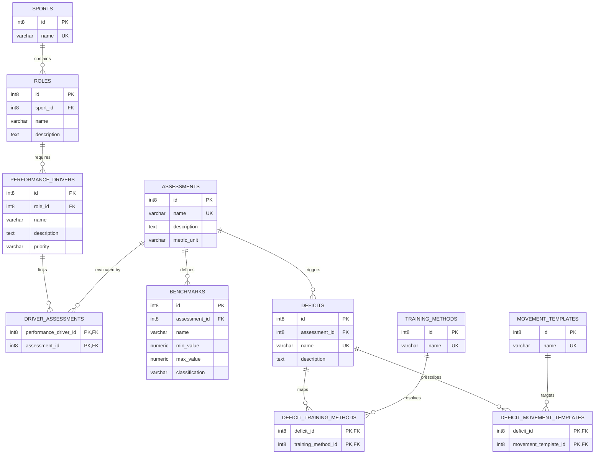

# Forge S&C Knowledge Graph V1 Specification
**Author: Lead Sports Scientist & Domain Architect**  
**Date: 2026-06-15**

---

## 1. Physical Entity-Relationship (ER) Diagram

The diagram below maps the complete physical model of the S&C Knowledge Graph V1, showing how sports and roles link down to assessments, deficits, training methods, and templates.



---

## 2. Sports Science Relationship Flow

The Knowledge Graph models a diagnostic path: an athlete's physical capability is assessed against role-specific benchmarks; if a deficit is identified, the system maps it directly to targeted S&C training methods and templates.

### Diagnostic Flow Example (Cricket Fast Bowler)
1. **Sport**: Cricket
2. **Role**: Fast Bowler
3. **Performance Driver**: *Front Foot Brace Force* (Primary physical demand to transfer speed to the ball).
4. **Assessment**: *Isometric Mid-Thigh Pull (IMTP)* (Measures peak vertical force capacity on force plates).
5. **Benchmark**: *IMTP Peak Force Poor* (Threshold set at $< 2200 \text{ N}$).
6. **Deficit**: *Lower Body Absolute Strength Deficit* (Triggered because the athlete scored $2100 \text{ N}$, falling into the "Poor" classification).
7. **Training Method**: *Cluster Sets* and *Maximal Strength* (Training protocols proven to stimulate motor unit recruitment).
8. **Movement Template**: *Cricket Fast Bowler Power* (prescribes a slot-based workout targeting bilateral extension and brace power).

---

## 3. SQL Query Examples

### Query A: Diagnostic Resolution & Workout Prescription
**Scenario**: An athlete playing a specific role (e.g. Fast Bowler) takes a test (e.g., Isometric Mid-Thigh Pull) and scores $2100 \text{ N}$ (which is "Poor"). 
The system runs this query to identify their physical deficits, list targeted training methods, and recommend corrective movement templates:

```sql
SELECT 
    d.name as diagnosed_deficit,
    d.description as deficit_description,
    b.classification as benchmark_result,
    tm.name as recommended_training_method,
    mt.name as corrective_template
FROM assessments a
JOIN benchmarks b ON a.id = b.assessment_id
JOIN deficits d ON a.id = d.assessment_id
LEFT JOIN deficit_training_methods dtm ON d.id = dtm.deficit_id
LEFT JOIN training_methods tm ON dtm.training_method_id = tm.id
LEFT JOIN deficit_movement_templates dmt ON d.id = dmt.deficit_id
LEFT JOIN movement_templates mt ON dmt.movement_template_id = mt.id
WHERE a.name = 'Isometric Mid-Thigh Pull (IMTP)'
  AND (b.min_value IS NULL OR 2100.00 >= b.min_value)
  AND (b.max_value IS NULL OR 2100.00 <= b.max_value)
  AND d.name = 'Lower Body Absolute Strength Deficit';
```

### Query B: Role Needs Analysis
**Scenario**: Pulls all physical drivers, priorities, and testing protocols required to evaluate an athlete playing a given role (e.g. Wicket Keeper):

```sql
SELECT 
    pd.name as performance_driver,
    pd.priority as driver_priority,
    a.name as assessment_name,
    a.metric_unit as measurement_unit
FROM roles r
JOIN performance_drivers pd ON r.id = pd.role_id
JOIN driver_assessments da ON pd.id = da.performance_driver_id
JOIN assessments a ON da.assessment_id = a.id
WHERE r.name = 'Wicket Keeper'
ORDER BY 
    CASE pd.priority
        WHEN 'Primary' THEN 1
        WHEN 'Secondary' THEN 2
        WHEN 'Tertiary' THEN 3
    END;
```

---

## 4. Future Expansion Strategy (Tennis & Badminton)

Because this schema is fully data-driven, adding support for new sports does not require code or schema changes. Below is the blueprint mapping Tennis and Badminton into the V1 Knowledge Graph.

### A. Tennis Integration Map
- **Sport**: `Tennis` (Category: Individual Sports)
- **Roles**: `Baseline Player`, `Serve & Volley Specialist`, `All-Court Player`
- **Performance Drivers**:
  - *Lateral Deceleration Capacity* (Primary for Baseline players moving side-to-side).
  - *Rotational Trunk Power* (Primary for explosive groundstrokes).
  - *Shoulder Rotator Cuff Stability* (Primary for serving velocities).
- **Assessments**:
  - *5-10-5 Shuttle Run* (Measures change of direction).
  - *Medicine Ball Side Toss Velocity* (Measures rotational power).
- **Deficits**: *Lateral Deceleration Deficit* (Triggered if 5-10-5 shuttle time $> 5.2\text{s}$).
- **Corrective Templates**: Maps to *Rotational Power* and *Reactive Agility* templates.

### B. Badminton Integration Map
- **Sport**: `Badminton` (Category: Individual Sports)
- **Roles**: `Singles Player`, `Doubles Specialist`
- **Performance Drivers**:
  - *Vertical Landing Force Absorption* (Primary for high-volume jump smashes).
  - *Overhead Extension Speed* (Primary for lunging intercept power).
- **Assessments**:
  - *Drop Jump Landing Stiffness* (Force plate assessment).
  - *Reactive T-Test* (Measures court coverage speed).
- **Deficits**: *Landing Force Absorption Deficit*.
- **Corrective Templates**: Maps to *Reactive Agility* template (focusing on fast plyometrics and drop landing absorption).

---

## 5. Architectural Decision Recommendations (ADRs)

### ADR-006: Relational Diagnostic Engine
- **Decision**: Perform athlete deficit analysis using SQL range joins against the `benchmarks` and `deficits` tables, rather than hardcoding threshold check rules in backend application code.
- **Rationale**: Keeps testing logic flexible. S&C coaches can adjust testing thresholds (e.g. changing an optimal CMJ height from 40cm to 42cm) via a database insert, keeping data-access rules unified.

### ADR-007: Unitless Testing Metrics
- **Decision**: Design the `assessments` table with a string field `metric_unit` and define `benchmarks` with numeric `min_value` and `max_value` fields.
- **Rationale**: Supports any assessment protocol (seconds for speed tests, Newtons for force pulls, centimeters for jump heights, or reps for endurance trials) using a single, unified database schema.
