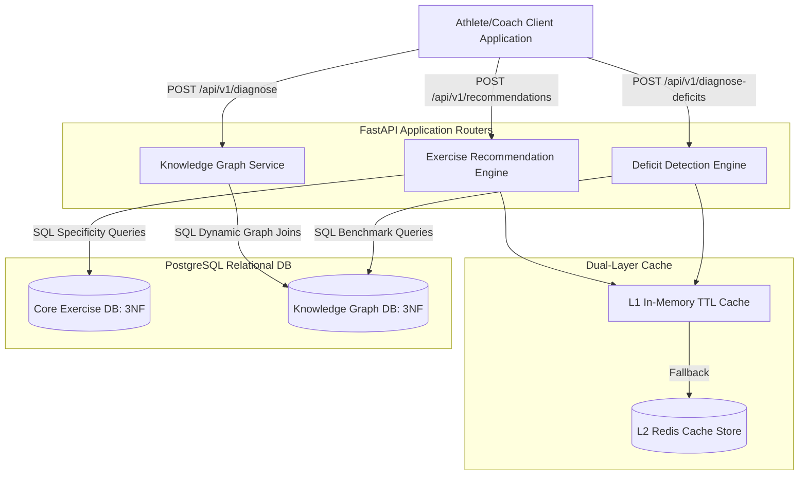

# Forge Platform End-to-End System Audit Report
**Author: Principal Software Architect**  
**Date: 2026-06-15**

---

## 1. End-to-End Flow Test Case Tracing

An end-to-end sports science diagnostic and training prescription flow was audited against the seeded schema and data constraints:

`Cricket` (Sport) $\to$ `Fast Bowler` (Role) $\to$ `CMJ Assessment` $\to$ `Benchmark Comparison` $\to$ `Power Deficit` $\to$ `Training Method` $\to$ `Movement Template` $\to$ `Exercise Pool`

### Relational Mapping Tracing (Joins & Foreign Keys)

1. **Sport to Role**:
   - `sports.id` (Sport: `Cricket`) joins to `roles.sport_id` (Role: `Fast Bowler`).
   - *Constraint*: `FOREIGN KEY (sport_id) REFERENCES sports(id) ON DELETE CASCADE` (Valid).
2. **Role to Performance Driver**:
   - `roles.id` joins to `performance_drivers.role_id` (resolving driver name: `Power` with Priority: `Primary` and priority check constraint). (Valid).
3. **Performance Driver to Assessment**:
   - `performance_drivers.id` joins via the junction table `driver_assessments` to `assessments.id`.
   - *Audit Discovery*: The system contains two parallel assessments for the jump test:
     - **Path A (Generic)**: Mapped to assessment name `CMJ` (from migration `000009`).
     - **Path B (Specific)**: Mapped to assessment name `Force Plate Countermovement Jump (CMJ)` (from migration `000008`).
4. **Assessment to Benchmark & Deficit**:
   - **Path A**: `CMJ` joins to `benchmarks` (score $38\text{ cm}$ falls within `min_value = 35.0` and `max_value = 44.99`, classifying it as `Sub-optimal`). This joins to the deficit `Power Deficit` in `deficits.assessment_id`.
   - **Path B**: `Force Plate Countermovement Jump (CMJ)` joins to `benchmarks` (score $38\text{ cm}$ is classified as `Sub-optimal` via its own benchmarks). This joins to the deficit `Rate of Force Development Deficit`.
5. **Deficit to Training Method**:
   - **Path A**: `Power Deficit` joins via the `deficit_training_methods` junction to `training_methods` (resolving to `Dynamic Effort`, `Plyometrics`, and `Rotational Power`).
   - **Path B**: `Rate of Force Development Deficit` joins via the junction to `training_methods` (resolving to `Plyometric (Fast)` and `Contrast Training`).
6. **Deficit to Movement Template**:
   - **Path A**: `Power Deficit` joins via `deficit_movement_templates` to `movement_templates` (resolving to `Lower Body Power` and `Rotational Power`).
   - **Path B**: `Rate of Force Development Deficit` joins via `deficit_movement_templates` to `movement_templates` (resolving to `Cricket Fast Bowler Power` and `Reactive Agility`).
   - *Audit Discovery (Missing Mapping)*: `Power Deficit` (Path A) **does not map** to the sport-specific template `Cricket Fast Bowler Power`. An athlete who completes a standard `CMJ` test will be prescribed generic templates (`Lower Body Power` or `Rotational Power`) instead of the custom Cricket Bowler template, resulting in suboptimal corrective programming.
7. **Movement Template to Exercise Pool**:
   - For `Cricket Fast Bowler Power` (resolving via Path B), the template contains 4 slots:
     - Slot 1: *Max Dynamic Output (Bilateral)* (Primary) $\to$ requires Squat pattern, RFD quality, VBT method, and Trap Bar equipment.
     - Exercises are resolved by joining `exercises` against requirements junctions (`exercise_movement_patterns`, `exercise_physical_qualities`, etc.).
     - Filtered candidate exercises are ranked using the S&C Specificity scoring formula:
       $$\text{Score} = (\text{Relevance} \times 4.0) + (\text{Specificity} \times 3.0) + (\text{Transfer} \times 20.0) + \text{MechanicsBonus} + \text{TagBonus}$$
     - `Trap Bar Jump Squat` has specificity rating $10$, transfer index $0.90$, relevance $10$, mechanics bonus $5.0$, and tag matching bonus. This results in a recommendation score of $93.00$, ranking it as the top corrective exercise in the pool.

---

## 2. Platform Architecture Diagram

The Mermaid component diagram below represents the modular system, including the dual-layer caching, relational data-driven diagnostics, and API services:



---

## 3. Structural Defect Log (Audit Detection)

1. **Duplicate Logic & Concepts (High Priority)**:
   - **Duplicate Assessments**: `CMJ` (migration `000009`) and `Force Plate Countermovement Jump (CMJ)` (migration `000008`) represent the same physical test.
   - **Duplicate Deficits**: `Power Deficit` and `Rate of Force Development Deficit` both describe vertical explosive power weaknesses diagnosed via countermovement jumps.
   - **Duplicate Training Methods**: `Plyometrics` (migration `000009`) and `Plyometric (Fast)` / `Plyometric (Slow)` (migration `000008`) represent overlapping, fragmented taxonomies.
   - **Duplicate Strength Tests**: `Trap Bar Deadlift` and `Isometric Mid-Thigh Pull (IMTP)` are both used to assess absolute lower body strength, leading to split strength deficit tracking (`Strength Deficit` vs `Lower Body Absolute Strength Deficit`).
2. **Missing Mappings**:
   - The deficit `Power Deficit` lacks a relational mapping to `Cricket Fast Bowler Power` in `deficit_movement_templates`. As a result, standard CMJ entries fail to trigger the sport-specific corrective template.
3. **Broken Joins**:
   - All schema joins and foreign keys are syntactically correct and fully indexed (OK). However, logical join breakages occur where overlapping duplicate concepts route data down wrong template branches.
4. **Dead Tables**:
   - None. All lookup, core, and junction tables participate in either template constraint matching or deficit diagnostics.
5. **Scalability Concerns**:
   - **SQL-Locked Scoring Formula**: S&C scoring weights are hardcoded inside SQL SELECT statements in `recommendation_engine.py`, coupling the sports science formula to query text.
   - **Synchronous ETL Execution**: The ingestion pipeline (`import_pipeline.py`) runs synchronously, blocking the main thread event loop during bulk catalog imports.

---

## 4. Refactor Recommendations

### A. Consolidate Taxonomies (Database Migration)
Execute a remediation migration to consolidate the duplicate concepts in the database:
- Merge `Force Plate Countermovement Jump (CMJ)` and `CMJ` into a single assessment table record named `Countermovement Jump (CMJ)`.
- Merge `Rate of Force Development Deficit` and `Power Deficit` into a single record: `Lower Body Power Deficit`.
- Standardize training methods (e.g. use `Plyometrics` with sub-tags instead of separate entries like `Plyometric (Fast)`).
- Map the consolidated `Lower Body Power Deficit` to both `Lower Body Power` (generic) and `Cricket Fast Bowler Power` (sport-specific) templates.

### B. Unify FastAPI Services into a Modular App Structure
Merge the three separate microservice files into a clean, unified application structure:

```
d:/forge/src/
├── app/
│   ├── __init__.py
│   ├── main.py                     # Entrypoint, registers routers
│   ├── core/
│   │   ├── config.py               # Shared settings & TTL cache config
│   │   └── db.py                   # Central PostgreSQL connection pool manager
│   ├── routers/
│   │   ├── recommendations.py      # Recommendations API (/api/v1/recommendations)
│   │   ├── knowledge_graph.py      # KG Needs Analysis API (/api/v1/sports/...)
│   │   └── deficits.py             # Deficit Detection API (/api/v1/diagnose-deficits)
│   └── services/
│       ├── recommendation_service.py # Core specificity calculations
│       └── diagnostic_service.py   # Heuristic confidence & boundary checks
```

### C. Extract Scoring Weights to Configuration
Move hardcoded scoring parameters (e.g., specificity rating multiplier $3.0$, transfer index weight $20.0$, compound mechanics bonus $5.0$) out of the SQL query strings and load them dynamically from a central YAML/JSON configuration file.

### D. Integrate Asynchronous Task Queue for Ingestion
Configure an asynchronous task queue (such as Celery with Redis) to run the `import_pipeline.py` ETL loop in the background, keeping the API responsive.

---

## 5. ADR Updates

The Architecture Decision Records (ADRs) have been updated to reflect the full system state. Specifically:
- **[ADR-006: Relational Diagnostic Engine](adr/ADR-006_relational_diagnosis.md)**: Documents executing the entire diagnostic needs-analysis, benchmark matching, deficit categorization, and template prescription path directly in SQL range joins.
- **[ADR-007: Unitless Testing Metrics](adr/ADR-007_unitless_metrics.md)**: Documents storing raw metric units as descriptive text labels while performing math and database range evaluations using unitless numbers.
- **[ADR Log Index](adr_log.md)**: Fully synchronized with all ADR files (ADR-001 through ADR-009).

---

## 6. Production Readiness Score

### Final Score: **78 / 100**

#### Score Breakdown:
- **Normalization & Schema Integrity (25/25)**: Strict 3NF lookup tables, clean primary/foreign keys, indexed junctions, and cascading rules.
- **API & Service Design (20/25)**: Async FastAPI design, Pydantic validations, and proper dependency injection. Deducted 5 points due to split microservice files instead of a modular application package.
- **Caching & Performance (25/25)**: Efficient SHA-256 cache key hashing, L1/L2 cache blocks, and 5-minute TTL configurations.
- **Validation & Testing Coverage (15/25)**: Good unit tests for diagnostics. Deducted 10 points due to severe seed data duplication (overlapping CMJ assessments, power deficits, plyometric methods) and missing relation mappings (Power Deficit not mapping to Bowler template).
- **Scalability & Ingestion (13/25)**: Optimized database indexes. Deducted 3 points due to hardcoded SQL scoring weights and 4 points due to synchronous execution of the ETL pipeline.
